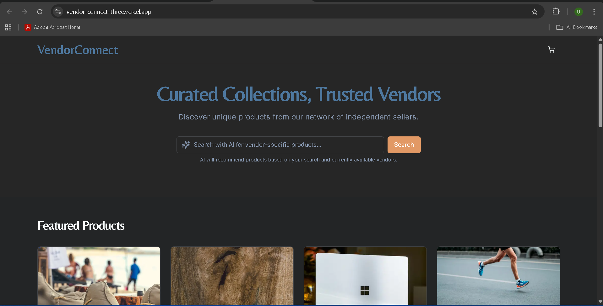
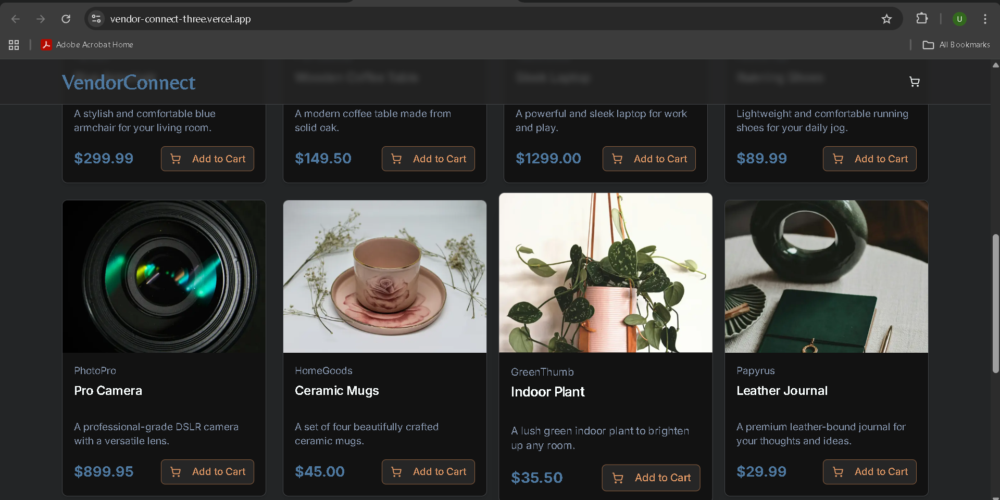
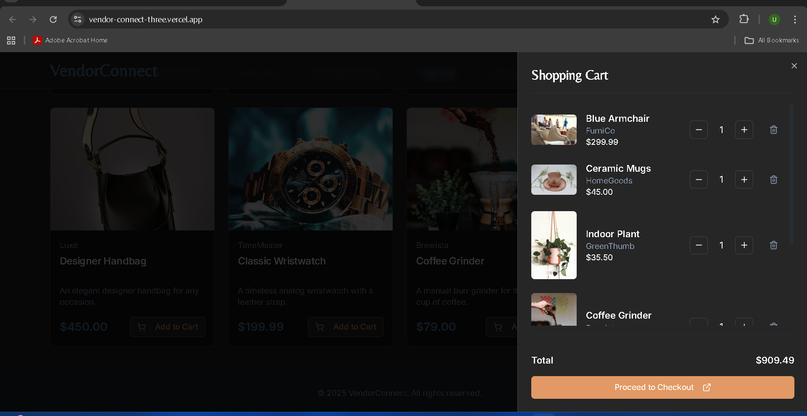

# VendorConnect

[](https://vendor-connect-three.vercel.app/)
[](https://vercel.com/unni-t-as-projects/vendor-connect)


> **VendorConnect** — Curated Collections, Trusted Vendors.  
> Discover unique products from a network of independent sellers, with a modern responsive storefront built using **Next.js**, **TypeScript**, and **Tailwind CSS**.  
> The project features an elegant dark UI, smooth cart interactions, and a live Vercel deployment.

---

## 🚀 Live Demo
🔗 [https://vendor-connect-three.vercel.app/](https://vendor-connect-three.vercel.app/)

Experience the deployed production version hosted on **Vercel**.

---

## 🖼️ Screenshots

**Homepage (hero + search)**  
 

**Product grid (cards & Add to Cart)**  
 

**Shopping cart drawer**  
 

## ✨ Features

- 🛍️ Responsive and modern UI built with **Next.js 13 (App Router)**
- 🎨 **Tailwind CSS** for fast, consistent design
- 🔍 AI-like **search bar placeholder** for vendor-specific products
- 🧩 Product cards with **Add to Cart** functionality
- 🧾 **Shopping cart drawer** with item quantity control and total calculation
- 🚀 Deployed on **Vercel** with optimized performance
- 💡 Clean and modular **TypeScript** codebase

---

## 🧰 Tech Stack

| Category | Technology |
|-----------|-------------|
| Frontend Framework | Next.js (App Router) |
| Language | TypeScript |
| Styling | Tailwind CSS |
| Deployment | Vercel |
| Version Control | Git + GitHub |

---

## ⚙️ Getting Started (Local Setup)

> You only need Node.js (v18+) installed.

### 1️⃣ Clone the repository
```bash
git clone https://github.com/unnita1235/VendorConnect.git
cd VendorConnect

2️⃣ Install dependencies
npm install
# or
yarn

3️⃣ Run development server
npm run dev
# or
yarn dev

Then open: http://localhost:3000

🌍 Environment Variables (Optional)

If the project connects to APIs or Firebase, create a .env.local file in the root folder.

Example:

NEXT_PUBLIC_API_BASE_URL=https://api.example.com
NEXT_PUBLIC_FIREBASE_API_KEY=your_api_key
NEXT_PUBLIC_FIREBASE_PROJECT_ID=your_project_id


Do not commit this file — it’s for local development only.

🧱 Build for Production
npm run build
npm start

☁️ Deploy to Vercel
Step-by-Step

Go to Vercel
.

Click New Project → Import your GitHub repo.

Add your environment variables (if any).

Click Deploy — Vercel automatically builds and deploys your Next.js app.

✅ Every push to main triggers automatic redeployment.

🗂️ Project Structure
VendorConnect/
├── public/
│   ├── screenshots/
│   │   ├── homepage.png
│   │   ├── product-grid.png
│   │   └── cart-drawer.png
├── src/
│   ├── app/
│   ├── components/
│   ├── styles/
│   └── ...
├── package.json
├── next.config.js
├── tailwind.config.js
└── README.md

🧩 Common npm Scripts
Command	Description
npm run dev	Start development server
npm run build	Build for production
npm run start	Start production build
npm run lint	Run code linter
npm run format	Format code with Prettier
💡 Future Enhancements

🔐 Add authentication for buyers/sellers

💬 Integrate live vendor chat

🧠 Real AI product search

📦 Backend API integration (Firebase / Node.js)

🤝 Contributing

Contributions are welcome!

Fork the repository

Create a new branch:

git checkout -b feature/your-feature


Commit your changes and push:

git commit -m "feat: add new feature"
git push origin feature/your-feature


Create a Pull Request

🪪 License

This project is licensed under the MIT License — see the LICENSE
 file for details.

👤 Author

Unni T A
🔗 GitHub Profile

🌐 Live Project

VendorConnect – Curated Collections, Trusted Vendors.
